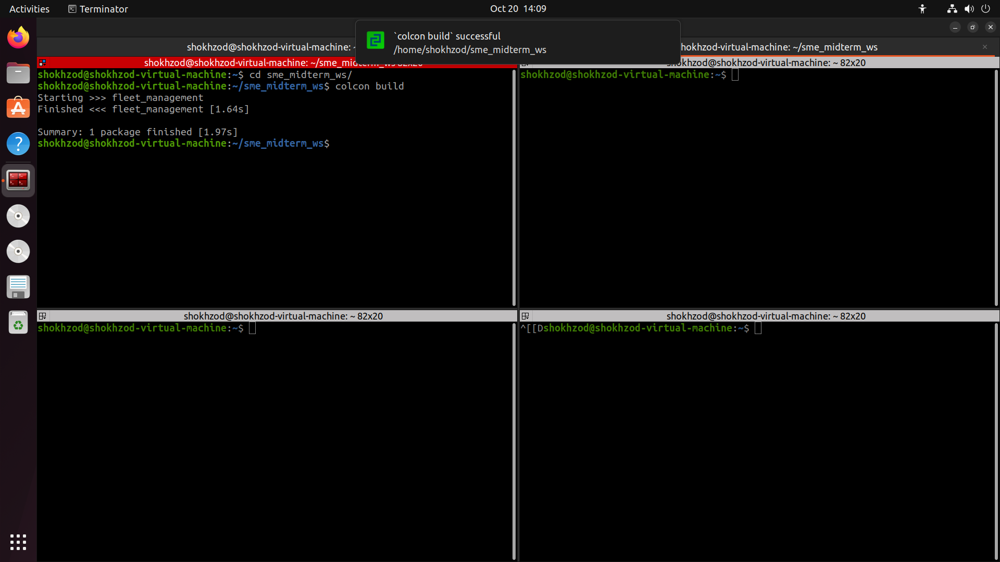
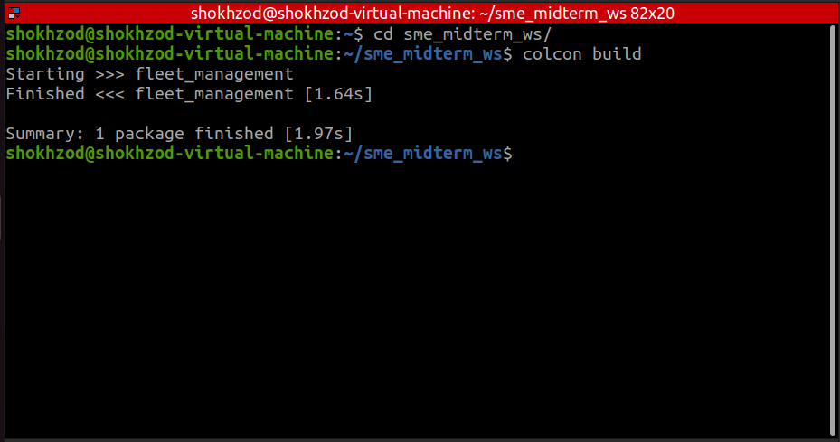
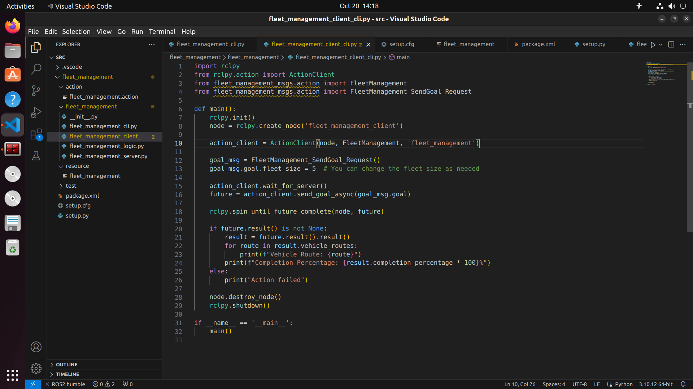
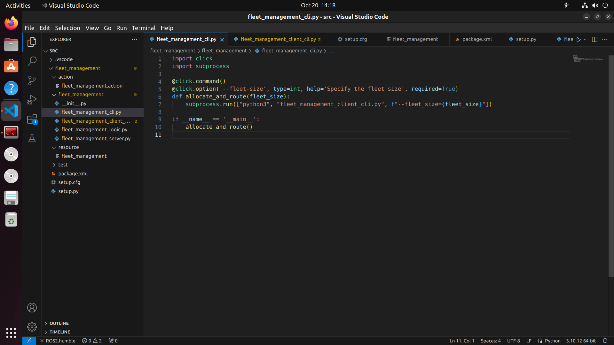
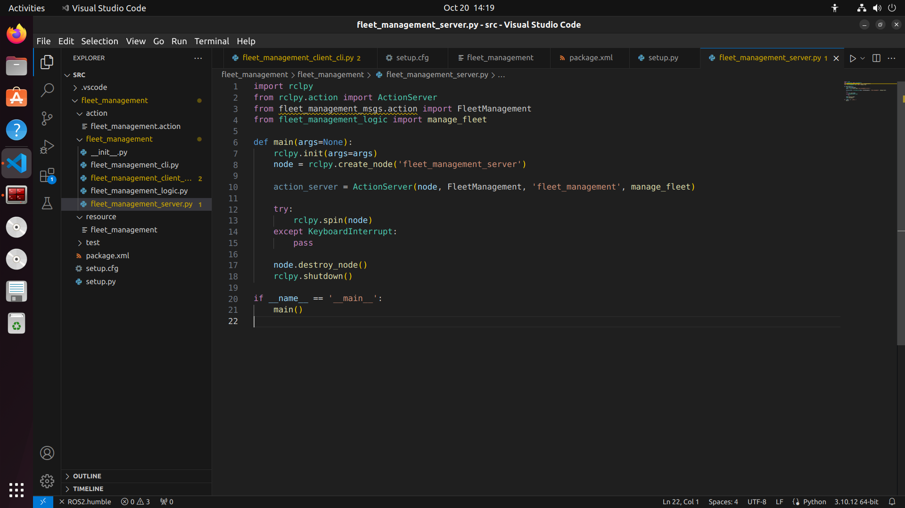
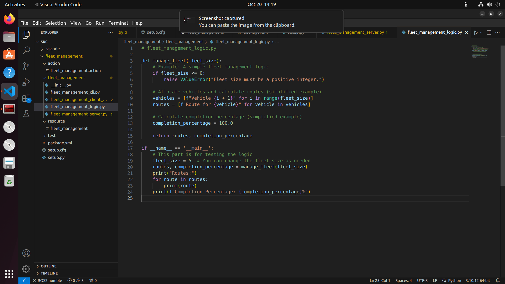
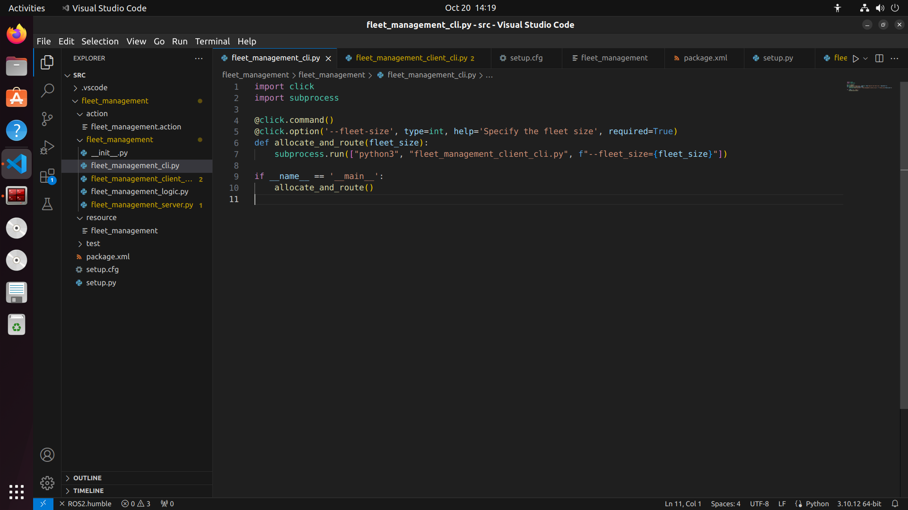
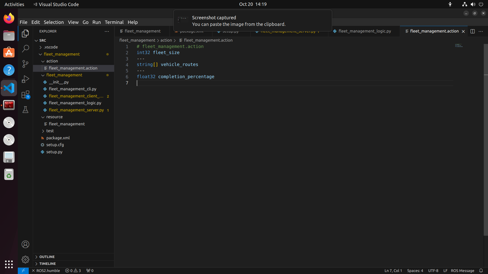

# ROS 2 Fleet Management

ROS 2 Fleet Management is a project that allows you to manage and allocate a fleet of vehicles using ROS 2's action messages. This project includes an Action Server and Action Client, as well as a professional Command Line Interface (CLI) to interact with the system.

## Table of Contents

- [Project Overview](#project-overview)
- [Prerequisites](#prerequisites)
- [Project Structure](#project-structure)
- [Getting Started](#getting-started)
- [Usage](#usage)

## Project Overview

The Fleet Management project consists of the following components:

- **ROS 2 Action**: Defines the `fleet_management` action message, which includes an action goal for specifying fleet size, an action result for vehicle routes, and an action feedback for completion percentage.

- **Action Server (fleet_management_server.py)**: Implements the Action Server, which receives fleet size requests, performs fleet management logic (e.g., allocation and routing), and returns calculated routes as the Action Result. Proper error handling and logging are included.

- **Action Client CLI (fleet_management_client_cli.py)**: Acts as the Action Client, allowing users to request fleet management tasks by specifying the fleet size. It sends the request to the server, receives the routes in response, and displays them to the user.

- **Professional CLI (fleet_management_cli.py)**: A Command Line Interface (CLI) designed using the Click library. It provides an option for users to allocate and route vehicles by specifying the fleet size. Internally, it calls the Action Client CLI to perform the task.

## Prerequisites

Before getting started, ensure you have the following prerequisites:

- [ROS 2](https://docs.ros.org/en/humble/Installation.html) installed and set up.
- Python 3.x installed.

## Project Structure

The project directory structure is organized as follows:

├── fleet_management
│ ├── action
│ │ ├── fleet_management.action
│ ├── fleet_management_server.py
│ ├── fleet_management_client_cli.py
│ ├── fleet_management_cli.py
├── README.md


- `fleet_management/action`: Contains the `fleet_management.action` file that defines the action message.
- `fleet_management_server.py`: The Action Server implementation.
- `fleet_management_client_cli.py`: The Action Client CLI.
- `fleet_management_cli.py`: The professional CLI using the Click library.
- `README.md`: This README file.

## Getting Started

1. Clone the repository or create a ROS 2 package and place the project files accordingly.

2. Generate action interfaces by running the following command within your ROS 2 workspace:

   ```bash
   ros2 interface package fleet_management
   ```

3. Build your workspace using colcon:
```
cd ~/ros2_ws  # Navigate to your ROS 2 workspace
colcon build
```

Source the workspace:
```
source ~/ros2_ws/install/local_setup.bash
```

### Usage
1. Start the Action Server:
```
ros2 run your_package fleet_management_server.py
```

Use the Action Client CLI to allocate and route vehicles by specifying the fleet size:

```
ros2 run your_package fleet_management_client_cli.py --fleet-size=5
```
Use the professional CLI to perform the same task:

```
ros2 run your_package fleet_management_cli.py allocate-and-route --fleet-size=5
```








